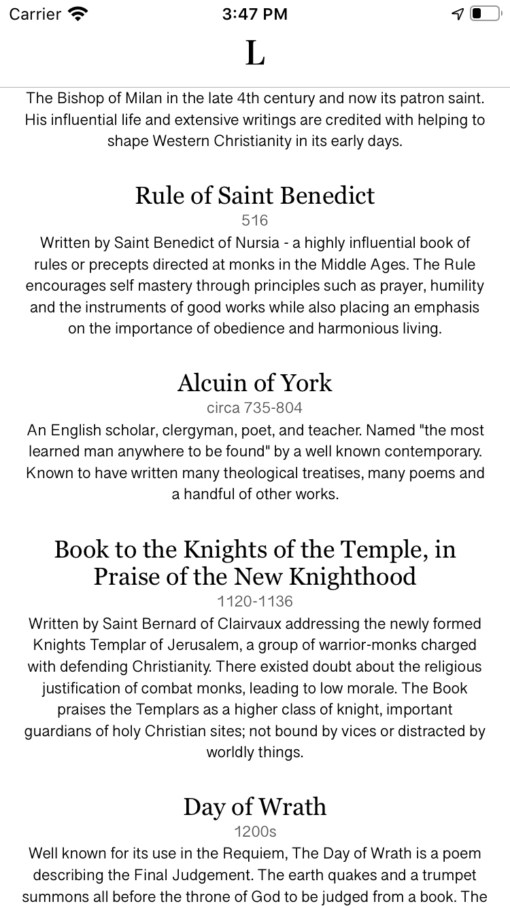
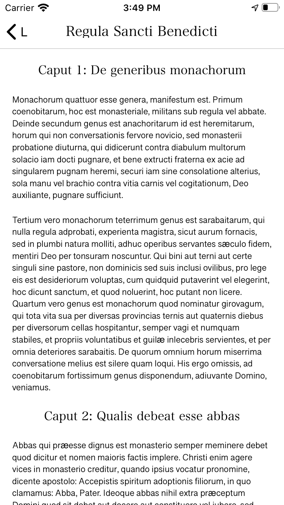

# DeadLanguage

### What is it?
DeadLanguage or LinguaMortua is a collection of less-mainstream Latin resources for reading and study. The idea arose from a desire to have reading material with me, beyond the Latin Bible.

### Why Objective-C?
It's a Latin app, so I figured I should write it in Objective-C and complete the dead language circle. Really the app is designed to be a reading resource, rather than an impressive piece of software anyway.

### No translations?
I considered adding English translations, but most are copyrighted and I didn't want to have a mixture of translated and untranslated text.

### Can I use this for my own work?
Yes. Most of the included Latin sources are from the Medieval time period or earlier and **all** are freely available under public domain. The app itself falls under the MIT License.

### Previews

  
   

